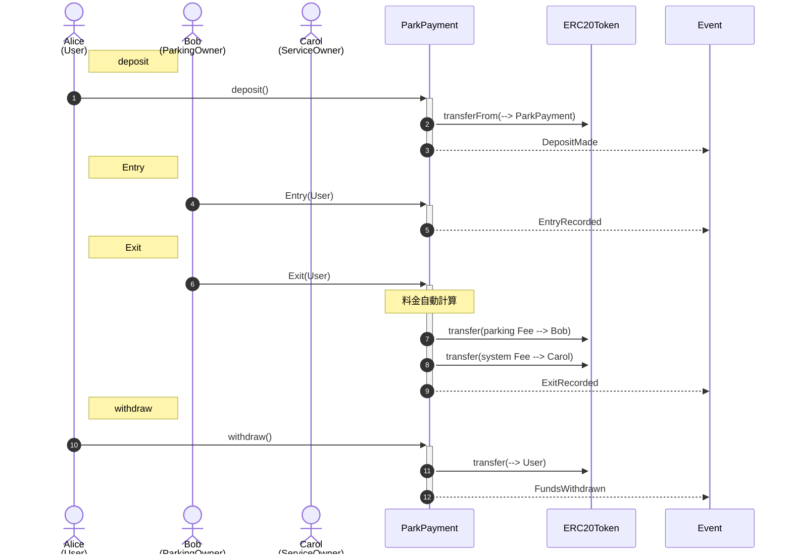
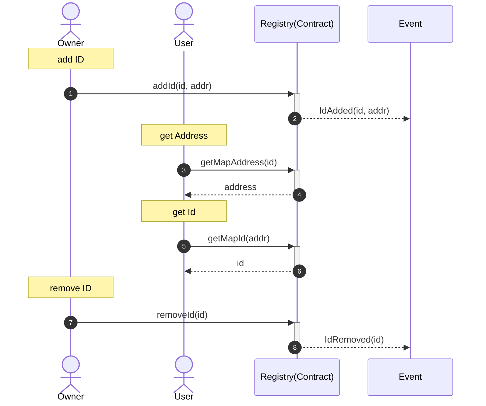
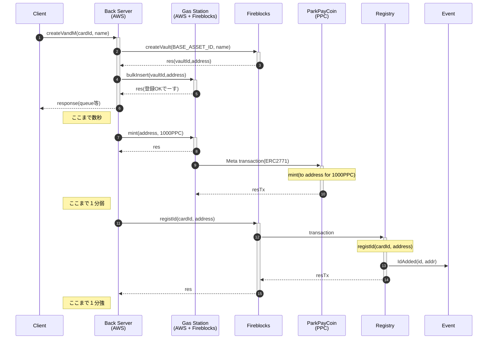
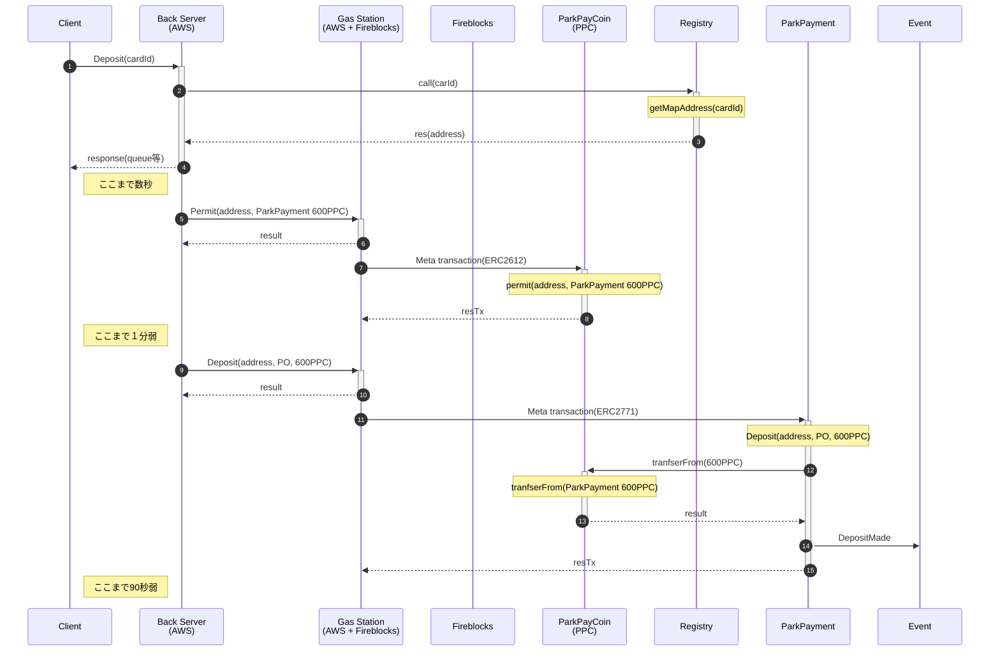
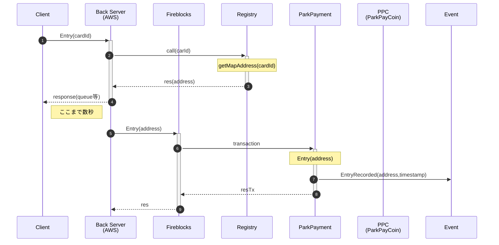
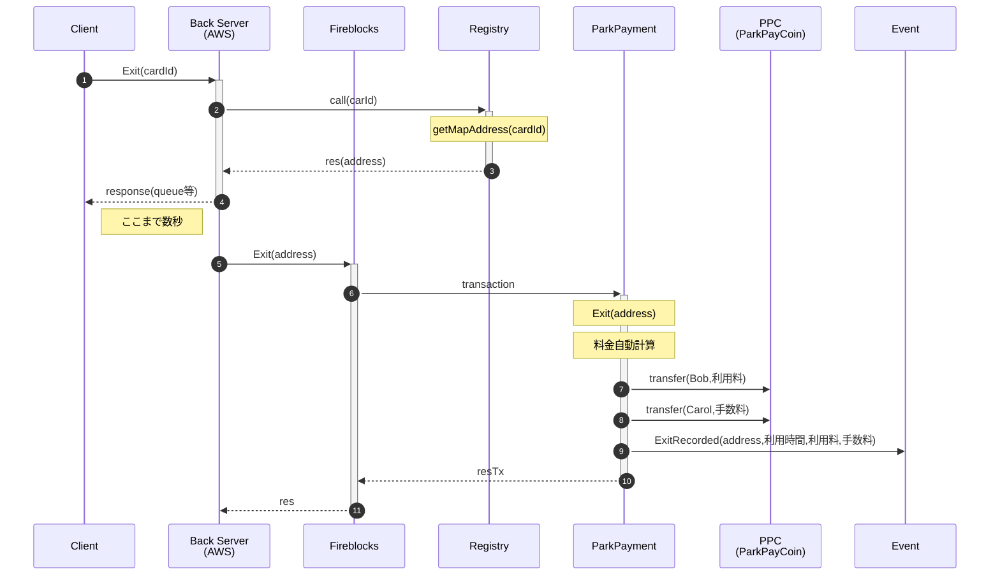

- [1. スマ婚要件](#1-スマ婚要件)
  - [1.1. エンティティ](#11-エンティティ)
  - [1.2. コントラクト仕様](#12-コントラクト仕様)
    - [1.2.1. ## STEP1 全般](#121--step1-全般)
    - [1.2.2. ## STEP2 事前登録](#122--step2-事前登録)
    - [1.2.3. ## STEP3 入庫時](#123--step3-入庫時)
    - [1.2.4. ## STEP4 出庫時](#124--step4-出庫時)
    - [1.2.5. ## STEP5 預託終了](#125--step5-預託終了)
    - [1.2.6. ##シーケンス図 (ParkingPayment)](#126-シーケンス図-parkingpayment)
  - [1.3. その他のコントラクト](#13-その他のコントラクト)
    - [1.3.1. Registry](#131-registry)
- [2. Deploy](#2-deploy)
  - [2.1. Token](#21-token)
  - [2.2. ParkingPayment](#22-parkingpayment)
  - [2.3. NFCAddressRegistry](#23-nfcaddressregistry)
- [3. Setup contracts (e.q. Amoy testnet)](#3-setup-contracts-eq-amoy-testnet)
  - [3.1. environment](#31-environment)
  - [3.2. Token](#32-token)
  - [3.3. Polygonscan verify](#33-polygonscan-verify)
- [4. cdk](#4-cdk)
- [5. API](#5-api)
  - [5.1. Task1 Create Vault and Mint(アドレス生成＆ミント)](#51-task1-create-vault-and-mintアドレス生成ミント)
  - [5.2. Task2 Deposit(利用登録＆トークン預託)](#52-task2-deposit利用登録トークン預託)
  - [Task3 Entry(入庫)](#task3-entry入庫)
  - [Task4 Exit(出庫)](#task4-exit出庫)

# 1. スマ婚要件

## 1.1. エンティティ

- Alice コインパーキングの利用者
- Bob コインパーキングの管理者
- Carol サービスオーナー（＝コントラクトオーナー）

## 1.2. コントラクト仕様

### 1.2.1. ## STEP1 全般

- このコントラクトは任意の ERC-20 トークンを扱うことができる
- コントラクトはパーキング管理者リスト(Bob など)を保有する
- コントラクトはパーキング入庫状態(Alice など)を保有する
- Carol はパーキング管理者リストに Bob を登録または削除することができる
- Carol は料金レート(1 分あたりの単価)を指定・更新することができる
- Bob は Alice の入庫および出庫を記録することができる

### 1.2.2. ## STEP2 事前登録

- Alice は事前に預託金として任意のトークンをコントラクトにデポジットする
- このとき、Alice は Bob を指名する必要がある
- 続けて Alice は別種のトークンをデポジットすることもできる。再び Bob を指名しても良いし、別のパーキング管理者を指名しても良い
- Alice は一定期間(仮に 1 カ月とする)これを引き出すことができない

### 1.2.3. ## STEP3 入庫時

- Alice が Bob の駐車場に入庫したとき、Bob はコントラクトに「Alice が入庫した」ことを記録する

### 1.2.4. ## STEP4 出庫時

- Alice が Bob の駐車場を出庫したとき、Bob はコントラクトに「Alice が出庫した」ことを記録する
- コントラクトは Alice が滞在した時間(分)に料金レートを乗じた駐車料金を自動算出し、駐車料金からシステム手数料（仮に３％とする）を差し引いた分を Bob に送金し、システム手数料を Carol に送金する。最後にこれらに相当する金額を Alice のデポジットから差し引くことで清算を完了する

### 1.2.5. ## STEP5 預託終了

- 一定期間経過後、Alice はデポジット残高を Alice のアドレスへ引き出すことができる。これはトークンの種類ごとに実行する必要がある。
- Carol だけはいつでも Alice のデポジット残高を Alice のアドレスへ引き戻すことができる

### 1.2.6. ##シーケンス図 (ParkingPayment)



## 1.3. その他のコントラクト

### 1.3.1. Registry

ユーザ ID と address 情報を紐付け保存しておくコントラクト



# 2. Deploy

## 2.1. Token

```bash

## test
npx hardhat run scripts/deploy_V21.js --network hardhat

## amoy from EoA
npx hardhat run scripts/deploy_V21.js --network amoy_metamask

```

## 2.2. ParkingPayment

```bash

## test
npx hardhat run scripts/deploy_ParkingPayment.js --network hardhat

## amoy from EoA
npx hardhat run scripts/deploy_ParkingPayment.js --network amoy_metamask

## amoy update to V2 from contructOwner
npx hardhat run scripts/deploy_ParkingPaymentV2.js --network amoy_contractUpgrade

```

## 2.3. NFCAddressRegistry

```bash

## test
npx hardhat run scripts/deploy_NFCAddressRegistry.js --network hardhat

## amoy from EoA
npx hardhat run scripts/deploy_NFCAddressRegistry.js --network amoy_metamask

```

# 3. Setup contracts (e.q. Amoy testnet)

## 3.1. environment

`.env`

```bash
#### ------- METAMASK ----------------- #####
# Metamask 01_mahiro_tester
METAMASK_PRIVATE_KEY=******
METAMASK_ADDR_METAMASK=******


#### ------- hardhat ------------------- #####
#DomainSeparator parameter
DOMAIN_SEPARATOR_PARAM_NAME=MyForwarderDomain
DOMAIN_SEPARATOR_PARAM_VERSION=1
DOMAIN_SEPARATOR_PARAM_NAME_TOKEN=ParkPayCoinV2
DOMAIN_SEPARATOR_PARAM_VERSION_TOKEN=1
#Polygonscan
POLYGONSCAN_API_KEY=******

#### ------- aws ----------------------- #####
SSM_SECRET_NAME=******
SSM_REGION=ap-northeast-1

#### ------- alchemy ------------------- #####
# API_KEY in Polygon Amoy
ALCHEMY_API_KEY=******
ALCHEMY_HTTPS=https://polygon-amoy.g.alchemy.com/v2/********

#### --------- web3 --------------------- #####
# Amoy Explorer
EXPLOERE=https://amoy.polygonscan.com

# JST_API_KEY
JSTv2_API_KEY=******


#### --------- GSN --------------------- #####
API_GATEWAY_APIKEY=******
API_GATEWAY_URL=https://******.execute-api.ap-northeast-1.amazonaws.com/v1
DOMAIN_SEPARATOR_PARAM_NAME_TOKEN=ParkPayCoinV2
DOMAIN_SEPARATOR_PARAM_VERSION_TOKEN=1
## psql -h dbproxy-amppc.proxy-******.ap-northeast-1.rds.amazonaws.com -U postgres -d jstv2db

#### ------ fireblocks ---------------- #####


## API
FIREBLOCKS_API_KEY_SIGNER=******
FIREBLOCKS_URL=https://api.fireblocks.io
FIREBLOCKS_VAULT_ACCOUNT_ID=22 # ALICE
FIREBLOCKS_VAULT_ACCOUNT_ID_TARGET=23 #BOB
FIREBLOCKS_VAULT_ACCOUNT_ID_RELAYER=24 # RAY
FIREBLOCKS_VAULT_ACCOUNT_ID_DEPLOYER=24 # RAY
FIREBLOCKS_VAULT_ACCOUNT_ID_CONTRACTOWNER=24 # contract owner
FIREBLOCKS_VAULT_ACCOUNT_ID_CONTRACTOWNER_ADDR=0x46FA7F84edcED825F8F8E237fbf1B8C5954C2E0E
FIREBLOCKS_VAULT_ACCOUNT_ID_SERVICEOWNER=24
FIREBLOCKS_VAULT_ACCOUNT_ID_SERVICEOWNER_ADDR=0x46FA7F84edcED825F8F8E237fbf1B8C5954C2E0E
FIREBLOCKS_VAULT_ACCOUNT_ID_PARKOWNER=39 # ELEN
FIREBLOCKS_VAULT_ACCOUNT_ID_PARKOWNER_ADDR=0x3F0996d182aB9c1942b7b46dAb35e5eEc154fD75
FIREBLOCKS_ASSET_ID=AMOY_POLYGON_TEST
FIREBLOCKS_ASSET_ID_MYTOKEN=PPC_AMOY_POLYGON_TEST_TAB5
POLYGON_RPC_URL=https://rpc.ankr.com/polygon_amoy

### memo : address
## ALICE 22  0x26969ed0c4ebAd2e491a5fba4e6fdbb06cD972Cc
## BOB   23  0xafBf06e0D57bAba855d38e21e30d74469c17D31e
## RAY   24  0x46FA7F84edcED825F8F8E237fbf1B8C5954C2E0E
## ELEN  39  0x3F0996d182aB9c1942b7b46dAb35e5eEc154fD75
## Frieren 102 0xA9dE95fD801F3Ae916A39C0eeF706239162ebe37
## Giorno 103 0x7224C3e745381F4C0579a5Bc8975c397Cbb45297

####-------------------------------------------------####
#### Polygon Amoy by METAMASK at 2024/05/16
####-------------------------------------------------####
DELEGATOR_CA=0x86e152cC3064B79856B7C6b54b8cB0af612bcD61 # re-deploy 2024/05/19
FORWARDER_CA=0xF0085882d78c455d5CcF3a25EAE033e44D6701E1

####-------------------------------------------------####
#### Polygon Amoy by METAMASK at 2024/05/21
####-------------------------------------------------####
PARKINGPAYMENTPROXY_CA=0x08c3b89fFb63E9FE62Ed8C95Df9e53e3daB53e96
NFCADDRESSREGISTRYPROXY_CA=0x990C6E8d693577D1eD2F1F7a1CC2FAE4EB7Ecd47
TOKENPROXY_CA=0xc692CDb48Ad01Fe7388A213374869556C88B1fFb
```

`.env.vaults`

```javascript
const minters = [
  {
    name: "JSTV21-MINTER01",
    vaultId: 237,
    address: "0xd77bA82501270D7Cf0df7124Cd1a7f39719E357A",
  },
  {
    name: "JSTV21-MINTER02",
    vaultId: 238,
    address: "0x5B60b4d94c5656F1bbd722A0344e8DFDE066840b",
  },
  {
    name: "JSTV21-MINTER03",
    vaultId: 239,
    address: "0xBbF86cE24b24031C694BA4219dEe29Fc894f0398",
  },
  {
    name: "JSTV21-MINTER04",
    vaultId: 240,
    address: "0x615Ae636e6dEBeA90042585492Aa2f4a93E5BDD9",
  },
  {
    name: "JSTV21-MINTER05",
    vaultId: 241,
    address: "0x79A307d20b11E53a55B443Dab353Fb7Ba8FF108e",
  },
  {
    name: "JSTV21-MINTER06",
    vaultId: 242,
    address: "0x85Fc83af294A30fD49A4C26c42294A211689EeaB",
  },
  {
    name: "JSTV21-MINTER07",
    vaultId: 243,
    address: "0xB8843E89B36b57A5649916efB60F1783fEC5346b",
  },
  {
    name: "JSTV21-MINTER08",
    vaultId: 244,
    address: "0x44AD7b8b9302ACA364d75915ec5cBA122B2B096e",
  },
];

module.exports = {
  minters,
};
```

## 3.2. Token

```bash

## addMinter
node tools/01.addMinters.js

## add parkingOwner
node tools/02.registParkOwner.js

```

## 3.3. Polygonscan verify

```bash

## token
npx hardhat verify --network amoy_metamask 0xc692CDb48Ad01Fe7388A213374869556C88B1fFb 0xF0085882d78c455d5CcF3a25EAE033e44D6701E1

## ParkingPayment
npx hardhat verify --network amoy_metamask 0x08c3b89fFb63E9FE62Ed8C95Df9e53e3daB53e96 0xF0085882d78c455d5CcF3a25EAE033e44D6701E1

## Registry
npx hardhat verify --network amoy_metamask 0x990C6E8d693577D1eD2F1F7a1CC2FAE4EB7Ecd47 0xF0085882d78c455d5CcF3a25EAE033e44D6701E1

```

# 4. cdk

```bash

## build
cd PPBS-stack/
./deployTool01_make.sh
./deployTool02_npm.sh

## install(不要)
#npx projen new awscdk-app-ts

## set up environment
npx cdk bootstrap

## project build
npx projen build

## project deploy
npx projen deploy

```

# 5. API

## 5.1. Task1 Create Vault and Mint(アドレス生成＆ミント)

```bash

## request
curl -w "\n%{http_code}\n" \
-X POST https://**********.execute-api.ap-northeast-1.amazonaws.com/v1/CreateVandM \
-H "Content-Type: application/json" \
-H "x-api-key: <YOUR_API_KEY>" \
-d '{
    "cardId": "id-2115",
    "name": "testName2115"
    }'

## response
{
  "message":"request is received",
  "result":{
    "cardId":"id-2115",
    "name":"testName2115",
    "vaultId":"263",
    "address":"0x64C606266732d51244cC23c86DCFE438b10EEF97",
    "queue":"0505b435-fa8d-41d9-be9f-d630998038eb"
  }
}
201
```

Back サーバがやってること

- Client からリクエストを受け付ける（主な引数はカード ID）
- Fireblocks で Vault を生成し、vaultID と address を払い出す
- vaultID と address の対応情報を Gas Station に登録する
- Client にレスポンスを返す（ラウンドトリップタイム目標 5 秒）
- address に 1000PPC を mint する
- カード ID と address の対応情報を Registry コントラクトに書き込む



## 5.2. Task2 Deposit(利用登録＆トークン預託)

```bash

## request
curl -w "\n%{http_code}\n" \
-X POST https://**********.execute-api.ap-northeast-1.amazonaws.com/v1/Deposit \
-H "Content-Type: application/json" \
-H "x-api-key: <YOUR_API_KEY>" \
-d '{
    "cardId": "id-2115"
    }'

## response
{
  "message":"request is received",
  "result":{
    "cardId":"id-2115",
    "from_addr":"0x64C606266732d51244cC23c86DCFE438b10EEF97",
    "queue":"537edb61-83ee-479f-93f5-5aee07ca4818"
  }
}
201
```

Back サーバがやってること

- Client からリクエストを受け付ける（引数はカード ID）
- Registry コントラクトに問い合わせて address を入手する
- Client にレスポンスを返す（ラウンドトリップタイム目標 3 秒）
- address から ParkPayment コントラクトに 600PPC の allowance を与える
- address から ParkPayment コントラクトに利用登録(デポジット)を行う
- ParkPayment コントラクトは address から 600PPC を受け取る



## Task3 Entry(入庫)

Back サーバがやってること

- Client からリクエストを受け付ける（引数はカード ID）
- Registry コントラクトに問い合わせて address を入手する
- Client にレスポンスを返す（ラウンドトリップタイム目標 3 秒）
- ParkPayment コントラクトに address の入庫&時刻を記録



## Task4 Exit(出庫)

Back サーバがやってること

- Client からリクエストを受け付ける（引数はカード ID）
- Registry コントラクトに問い合わせて address を入手する
- Client にレスポンスを返す（ラウンドトリップタイム目標 3 秒）
- ParkPayment コントラクトに address の出庫&時刻を記録するとともに、料金計算を行い、システム手数料(3%)を差し引いた分を Bob(駐車場管理者)に送金し、システム手数料を Carol(サービスオーナ)に送金する


