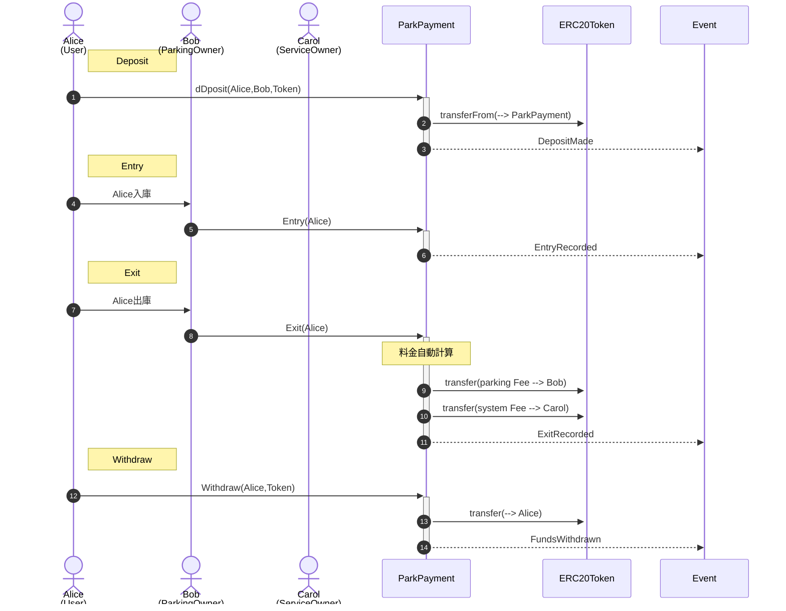
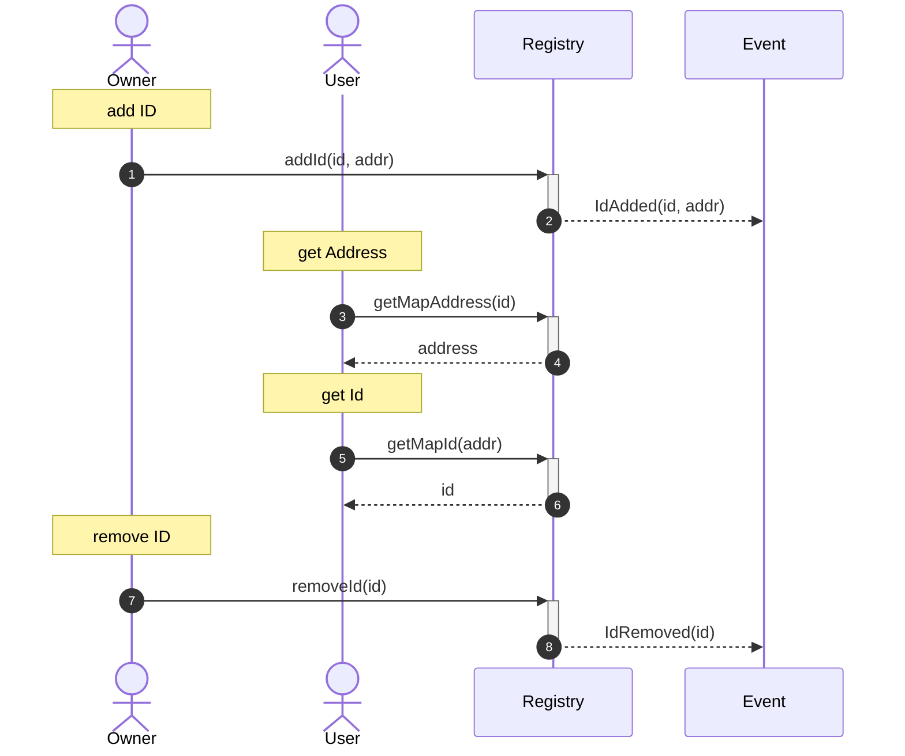
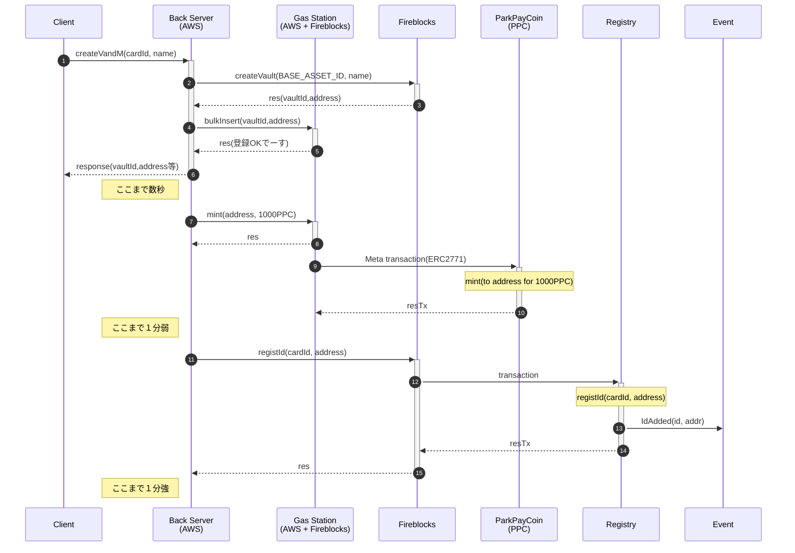
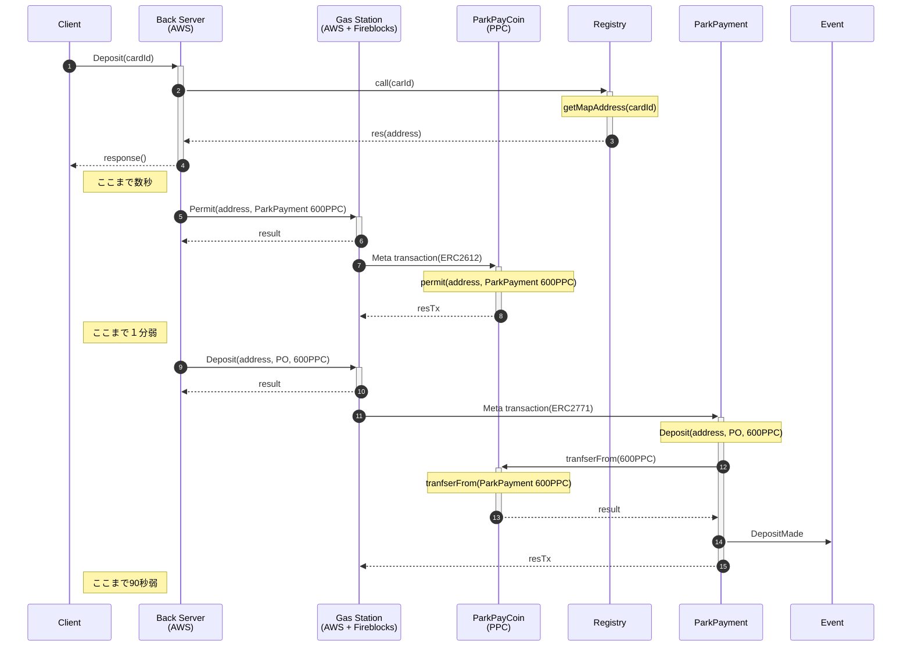
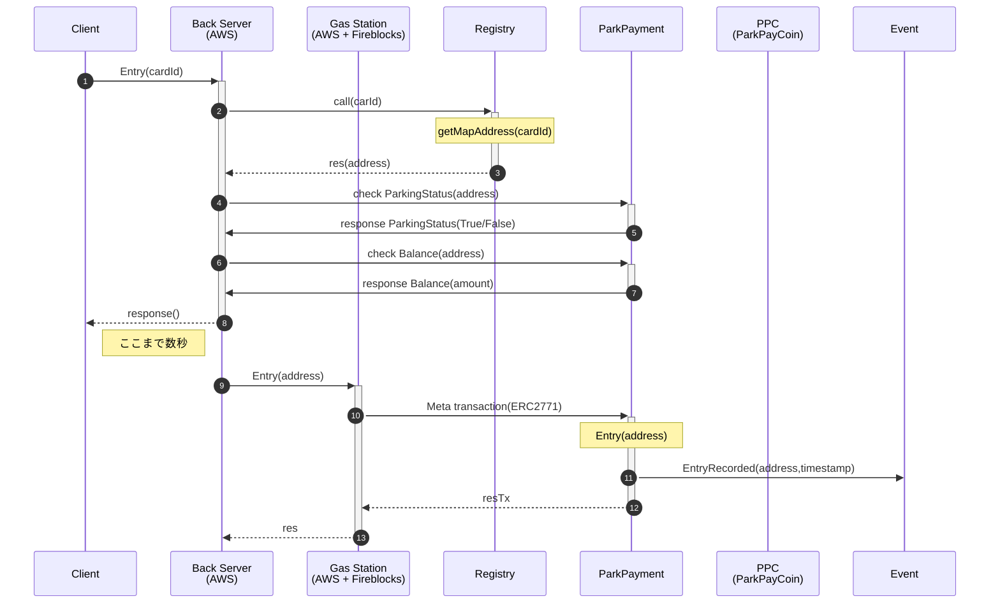
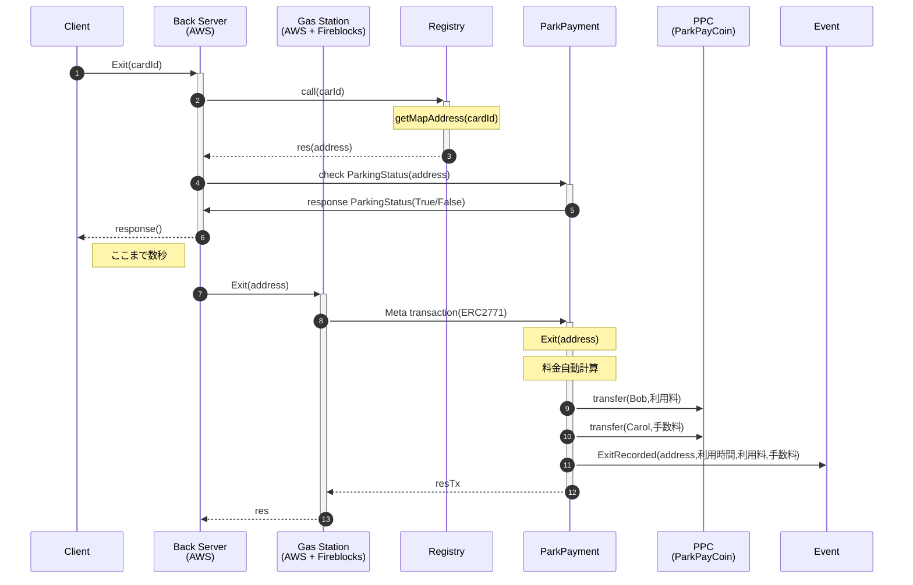
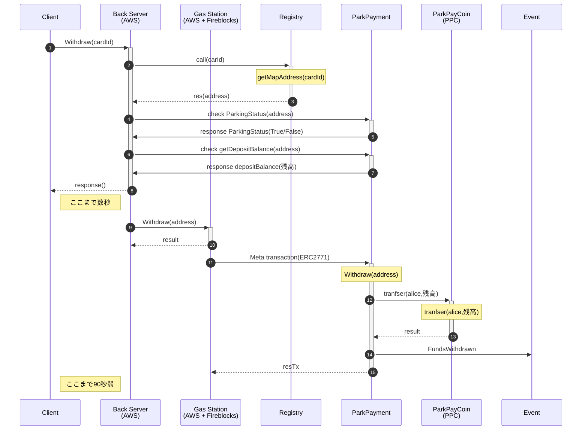

- [1. スマ婚要件](#1-スマ婚要件)
  - [1.1. エンティティ](#11-エンティティ)
  - [1.2. コントラクト仕様](#12-コントラクト仕様)
    - [1.2.1. ## STEP1 全般](#121--step1-全般)
    - [1.2.2. ## STEP2 事前利用契約＆デポジット](#122--step2-事前利用契約デポジット)
    - [1.2.3. ## STEP3 入庫時](#123--step3-入庫時)
    - [1.2.4. ## STEP4 出庫時](#124--step4-出庫時)
    - [1.2.5. ## STEP5 デポジット引き出し](#125--step5-デポジット引き出し)
    - [1.2.6. ##シーケンス図 (ParkingPayment)](#126-シーケンス図-parkingpayment)
  - [1.3. その他のコントラクト](#13-その他のコントラクト)
    - [1.3.1. Registry](#131-registry)
- [2. Deploy](#2-deploy)
  - [2.1. Token](#21-token)
  - [2.2. ParkingPayment](#22-parkingpayment)
  - [2.3. NFCAddressRegistry](#23-nfcaddressregistry)
- [3. Setup contracts (e.q. Amoy testnet)](#3-setup-contracts-eq-amoy-testnet)
  - [3.1. environment](#31-environment)
  - [3.2. Token](#32-token)
  - [3.3. Polygonscan verify](#33-polygonscan-verify)
- [4. cdk](#4-cdk)
- [5. API](#5-api)
  - [5.1. Task1 Create Vault and Mint(アドレス生成＆ミント)](#51-task1-create-vault-and-mintアドレス生成ミント)
  - [5.2. Task2 Deposit(利用登録＆トークン預託)](#52-task2-deposit利用登録トークン預託)
  - [5.3. Task3 Entry(入庫)](#53-task3-entry入庫)
  - [5.4. Task4 Exit(出庫)](#54-task4-exit出庫)
  - [5.5. Task5 Withdraw(契約終了＆引き出し)](#55-task5-withdraw契約終了引き出し)
  - [5.6. Others](#56-others)
    - [5.6.1. PPC/mint](#561-ppcmint)
    - [5.6.2. Info/getAddr](#562-infogetaddr)
    - [5.6.3. Info/getParkPayInfo](#563-infogetparkpayinfo)
- [6. Appendix](#6-appendix)
  - [6.1. The study of gas cost (ガスコストの研究)](#61-the-study-of-gas-cost-ガスコストの研究)

# 1. スマ婚要件

## 1.1. エンティティ

- Alice コインパーキングの利用者
- Bob コインパーキングの管理者
- Carol サービスオーナー（＝コントラクトオーナー）

## 1.2. コントラクト仕様

### 1.2.1. ## STEP1 全般

- このコントラクトは任意の ERC-20 トークンを扱うことができる
- このコントラクトはパーキング管理者リスト(Bob など)を保有する
- このコントラクトはパーキング入庫状態(Alice など)を保有する
- Carol はパーキング管理者リストに Bob を登録または削除することができる
- Carol は料金レート(1 分あたりの単価)を指定・更新することができる
- Bob は Alice の入庫および出庫を記録することができる

### 1.2.2. ## STEP2 事前利用契約＆デポジット

- Alice は事前に預託金として任意のトークンをコントラクトにデポジットする
- このとき、Alice は Bob を指名しておく必要がある
- ALice は必要に応じて同じトークンを追加デポジットすることもできる
- さらに Alice は別種のトークンを追加デポジットすることもできる
- 追加デポジットの際に再び Bob を指名しても良いし、別のパーキング管理者を指名しても良いが、後者の場合は Bob の指名は上書きされる
- Alice のデポジットは一定期間（仮に 1 カ月とする）ロックされ、その間 Alice はこれを引き出すことができない

### 1.2.3. ## STEP3 入庫時

- Alice が Bob の駐車場に入庫したとき、Bob はコントラクトに「Alice が入庫した」ことを記録する
- Alice のデポジット残高が 0 だった場合は上記の入庫処理は最初までリバート（切り戻し）する。すなわち Alice はデポジット残高を有しない限りコントラクト上は入庫扱いとならない

### 1.2.4. ## STEP4 出庫時

- Alice が Bob の駐車場を出庫したとき、Bob はコントラクトに「Alice が出庫した」ことを記録する
- このとき、コントラクトは Alice が滞在した時間(分)に料金レートを乗じた駐車料金を自動算出し、駐車料金からシステム手数料（仮に３％とする）を差し引いた分を Bob に送金し、残りのシステム手数料は Carol に送金する。最後にこれらに相当する金額を Alice のデポジット分から差し引くことで清算を完了する
- Alice のデポジット残高が精算額に満たない場合は上記の出庫処理は最初までリバート（切り戻し）する。すなわち Alice は不足分のデポジットを追加投入しない限りコントラクト上は出庫できない

### 1.2.5. ## STEP5 デポジット引き出し

- ロック期間経過後は、Alice は自身の判断に基づき、デポジット残高を Alice のアドレスへ引き出すことができる。これはトークンの種類ごとに実行することができる
- この処理は Alice が「出庫状態」にあるときのみ実行することができる。「入庫状態」であれば処理は最初までリバート（切り戻し）する
- Alice が全ての種類のトークンを引き出した時点で Bob への指名も自動的に解除される
- Carol だけはコントラクトオーナーの特権として、ロック期間満了の有無や Alice の入庫状態の有無によらず、いつでも Alice のデポジット残高を Alice のアドレスへ引き戻すことができる（緊急避難措置）

### 1.2.6. ##シーケンス図 (ParkingPayment)



## 1.3. その他のコントラクト

### 1.3.1. Registry

ユーザ ID と address 情報を紐付け保存しておくコントラクト

> （ユーザ ID ってのは有り体に言うと「NFC カード番号」とか「自動車のナンバープレート（のハッシュ）」とかのいい感じに個人情報を回避してる識別子。ぶっちゃけユニークな string であればなんでもいい。ブロックチェーンをデータベース化してみたいというモチベーションだけなのだァ！過程や！方法なぞ……！どうでもよいのだァーーッ）



# 2. Deploy

## 2.1. Token

```bash

## test
npx hardhat run scripts/deploy_V21.js --network hardhat

## amoy from EoA
npx hardhat run scripts/deploy_V21.js --network amoy_metamask

```

## 2.2. ParkingPayment

```bash

## test
npx hardhat run scripts/deploy_ParkingPayment.js --network hardhat

## amoy from EoA
npx hardhat run scripts/deploy_ParkingPayment.js --network amoy_metamask

## amoy update to V2 from contructOwner
npx hardhat run scripts/deploy_ParkingPaymentV2.js --network amoy_contractUpgrade

```

## 2.3. NFCAddressRegistry

```bash

## test
npx hardhat run scripts/deploy_NFCAddressRegistry.js --network hardhat

## amoy from EoA
npx hardhat run scripts/deploy_NFCAddressRegistry.js --network amoy_metamask

```

# 3. Setup contracts (e.q. Amoy testnet)

## 3.1. environment

`.env`

```bash
#### ------- METAMASK ----------------- #####
# Metamask 01_mahiro_tester
METAMASK_PRIVATE_KEY=******
METAMASK_ADDR_METAMASK=******

#### ------- hardhat ------------------- #####
#Polygonscan
POLYGONSCAN_API_KEY=******

#### ------- aws ----------------------- #####
SSM_REGION=ap-northeast-1

#### ------- alchemy ------------------- #####
# API_KEY in Polygon Amoy
ALCHEMY_API_KEY=******
ALCHEMY_HTTPS=https://polygon-amoy.g.alchemy.com/v2/********

#### --------- web3 --------------------- #####
# Amoy Explorer
EXPLOERE=https://amoy.polygonscan.com

#### --------- GSN --------------------- #####
API_GATEWAY_APIKEY=******
API_GATEWAY_URL=https://******.execute-api.ap-northeast-1.amazonaws.com/v1
DOMAIN_SEPARATOR_NAME_TOKEN=ParkPayCoinV2
DOMAIN_SEPARATOR_VERSION_TOKEN=1

#### ------ fireblocks ---------------- #####
FIREBLOCKS_API_KEY_SIGNER=******
FIREBLOCKS_URL=https://api.fireblocks.io

FIREBLOCKS_VID_CONTRACTOWNER=24 # contract owner
FIREBLOCKS_VID_CONTRACTOWNER_ADDR=0x46FA7F84edcED825F8F8E237fbf1B8C5954C2E0E
FIREBLOCKS_VID_SERVICEOWNER=24
FIREBLOCKS_VID_SERVICEOWNER_ADDR=0x46FA7F84edcED825F8F8E237fbf1B8C5954C2E0E
FIREBLOCKS_VID_PARKOWNER=39 # ELEN
FIREBLOCKS_VID_PARKOWNER_ADDR=0x3F0996d182aB9c1942b7b46dAb35e5eEc154fD75
FIREBLOCKS_ASSET_ID=AMOY_POLYGON_TEST
FIREBLOCKS_ASSET_ID_MYTOKEN=PPC_AMOY_POLYGON_TEST_TAB5
POLYGON_RPC_URL=https://rpc.ankr.com/polygon_amoy

####-------------------------------------------------####
#### Polygon Amoy by METAMASK at 2024/05/16
####-------------------------------------------------####
DELEGATOR_CA=0x86e152cC3064B79856B7C6b54b8cB0af612bcD61 # re-deploy 2024/05/19
FORWARDER_CA=0xF0085882d78c455d5CcF3a25EAE033e44D6701E1

####-------------------------------------------------####
#### Polygon Amoy by METAMASK at 2024/05/21
####-------------------------------------------------####
PARKINGPAYMENTPROXY_CA=0x08c3b89fFb63E9FE62Ed8C95Df9e53e3daB53e96
NFCADDRESSREGISTRYPROXY_CA=0x990C6E8d693577D1eD2F1F7a1CC2FAE4EB7Ecd47
TOKENPROXY_CA=0xc692CDb48Ad01Fe7388A213374869556C88B1fFb
```

`.env.vaults`

```javascript
const minters = [
  { name: "JSTV21-MINTER01", vaultId: 237, address: "0xd77bA82501270D7Cf0df7124Cd1a7f39719E357A" },
  { name: "JSTV21-MINTER02", vaultId: 238, address: "0x5B60b4d94c5656F1bbd722A0344e8DFDE066840b" },
  { name: "JSTV21-MINTER03", vaultId: 239, address: "0xBbF86cE24b24031C694BA4219dEe29Fc894f0398" },
  { name: "JSTV21-MINTER04", vaultId: 240, address: "0x615Ae636e6dEBeA90042585492Aa2f4a93E5BDD9" },
  { name: "JSTV21-MINTER05", vaultId: 241, address: "0x79A307d20b11E53a55B443Dab353Fb7Ba8FF108e" },
  { name: "JSTV21-MINTER06", vaultId: 242, address: "0x85Fc83af294A30fD49A4C26c42294A211689EeaB" },
  { name: "JSTV21-MINTER07", vaultId: 243, address: "0xB8843E89B36b57A5649916efB60F1783fEC5346b" },
  { name: "JSTV21-MINTER08", vaultId: 244, address: "0x44AD7b8b9302ACA364d75915ec5cBA122B2B096e" },
];

const parkingOwners = [
  { name: "PP-PO01", vaultId: 272, address: "0x17EeB1e2D55AF08edAbB47bEA0659A05daE2fEC3" },
  { name: "PP-PO02", vaultId: 273, address: "0xb0d7E1113B97af3d007bFA1bc9F203762f220045" },
  { name: "PP-PO03", vaultId: 274, address: "0x55aE9fa8Cc00693cc05Cb756A441d0344b2711b3" },
  { name: "PP-PO04", vaultId: 275, address: "0x47b6A34Da1D39aEaF784a2732A087f415C802E4b" },
  { name: "PP-PO05", vaultId: 276, address: "0x060Ddefc55FCF6a24C50CB8876294950A8733C94" },
  { name: "PP-PO06", vaultId: 277, address: "0xB8c42Ea9987fDAE00f4f7619aea65ee392471ff5" },
  { name: "PP-PO07", vaultId: 278, address: "0x12D2776AA98D08199678Dadeb669b7deB8b83D8A" },
  { name: "PP-PO08", vaultId: 279, address: "0x82Cad2B754218796123a0Dd626281779D619CE5D" },
];

module.exports = {
  minters,
  parkingOwners,
};
```

## 3.2. Token

```bash

## addMinter
node tools/01.addMinters.js

## add parkingOwner
node tools/02.registParkOwner.js

```

## 3.3. Polygonscan verify

```bash

## token
npx hardhat verify --network amoy_metamask 0xc692CDb48Ad01Fe7388A213374869556C88B1fFb 0xF0085882d78c455d5CcF3a25EAE033e44D6701E1

## ParkingPayment
npx hardhat verify --network amoy_metamask 0x08c3b89fFb63E9FE62Ed8C95Df9e53e3daB53e96 0xF0085882d78c455d5CcF3a25EAE033e44D6701E1

## Registry
npx hardhat verify --network amoy_metamask 0x990C6E8d693577D1eD2F1F7a1CC2FAE4EB7Ecd47 0xF0085882d78c455d5CcF3a25EAE033e44D6701E1

```

# 4. cdk

```bash

## build
cd PPBS-stack/
./deployTool01_make.sh
./deployTool02_npm.sh

## install(不要)
#npx projen new awscdk-app-ts

## set up environment
npx cdk bootstrap

## project build
npx projen build

## project deploy
npx projen deploy

```

# 5. API

| API                    | usage       | memo                             |
| ---------------------- | ----------- | -------------------------------- |
| v1/CreateVandM         | cardId,name | generate address & mint 1000PPC  |
| v1/Deposit             | cardId      | deposit 600PPC                   |
| v1/Entry               | cardId      | entry                            |
| v1/Exit                | cardId      | exit                             |
| v1/Withdraw            | cardId      | withdraw own deposit & initiate  |
| v1/PPC/mint            | cardId      | mint 1000PPC                     |
| v1/Info/getAddr        | cardId      | get address                      |
| v1/Info/getParkPayInfo | cardId      | get ParkPayment info for address |
|                        |             |                                  |

## 5.1. Task1 Create Vault and Mint(アドレス生成＆ミント)

```bash

## request
curl -w "\n%{http_code}\n" \
-X POST https://**********.execute-api.ap-northeast-1.amazonaws.com/v1/CreateVandM \
-H "Content-Type: application/json" \
-H "x-api-key: <YOUR_API_KEY>" \
-d '{
    "cardId": "id-2348",
    "name": "testName2348"
    }'

## response
{
    "message": "request is received",
    "result": {
        "cardId": "id-2348",
        "name": "testName2348",
        "vaultId": "309",
        "address": "0x4e08bB063E9475404Ec20DA0DF1555652d483FEc",
        "queue": "2bdbf09f-1ec6-46c2-ac77-275b9b4aefe6"
    }
}
201
```

Back サーバがやってること

- Client からリクエストを受け付ける（主な引数はカード ID）（→API-GW→Lambda）
- Fireblocks で Vault を生成し、vaultID と address を払い出す
- vaultID と address の対応情報を Gas Station に登録する
- Client にレスポンスを返す（ラウンドトリップタイム目標 5 秒）
- 異常系の場合はここで終了。正常系の場合はバックグラウンド処理に移行する（→SQS→Lambda）
- address に 1000PPC を mint する
- カード ID と address の対応情報を Registry コントラクトに書き込む



## 5.2. Task2 Deposit(利用登録＆トークン預託)

```bash

## request
curl -w "\n%{http_code}\n" \
-X POST https://**********.execute-api.ap-northeast-1.amazonaws.com/v1/Deposit \
-H "Content-Type: application/json" \
-H "x-api-key: <YOUR_API_KEY>" \
-d '{
    "cardId": "id-2348"
    }'

## response
{
    "message": "request is received",
    "result": {
        "cardId": "id-2348",
        "from_addr": "0x4e08bB063E9475404Ec20DA0DF1555652d483FEc",
        "queue": "23c8c67f-b91b-43ec-b2ca-6947dc0b3bb8"
    }
}
201
```

Back サーバがやってること

- Client からリクエストを受け付ける（引数はカード ID）（→API-GW→Lambda）
- Registry コントラクトに問い合わせて address を入手する
- Client にレスポンスを返す（ラウンドトリップタイム目標 3 秒）
- 異常系の場合はここで終了。正常系の場合はバックグラウンド処理に移行する（→SQS→Lambda）
- address から ParkPayment コントラクトに 600PPC の allowance を与える
- address から ParkPayment コントラクトに利用登録(デポジット)を行う
- ParkPayment コントラクトは address から 600PPC を受け取る



## 5.3. Task3 Entry(入庫)

```bash

## request
curl -w "\n%{http_code}\n" \
-X POST https://**********.execute-api.ap-northeast-1.amazonaws.com/v1/Entry \
-H "Content-Type: application/json" \
-H "x-api-key: <YOUR_API_KEY>" \
-d '{
    "cardId": "id-2348"
    }'

## response
{
    "message": "request is received",
    "result": {
        "cardId": "id-2348",
        "from_addr": "0x4e08bB063E9475404Ec20DA0DF1555652d483FEc",
        "queue": "701bb8bf-1554-43cf-bbe6-7c8449e67cb1"
    }
}
201
```

Back サーバがやってること

- Client からリクエストを受け付ける（引数はカード ID）（→API-GW→Lambda）
- Registry コントラクトにカード ID を問い合わせて、address を入手する
- ParkPayment コントラクトに address の現在 status を問い合わせて、True(入庫状態)であれば 400 エラー
- ParkPayment コントラクトに address の現在デポジット残高を問い合わせて、残高が 30PPC 未満であれば 400 エラー（デポジット追加して出直してきな）
- Client にレスポンスを返す（ラウンドトリップタイム目標 3 秒）
- 異常系の場合はここで終了。正常系の場合はバックグラウンド処理に移行する（→SQS→Lambda）
- ParkPayment コントラクトに address の入庫処理を行う（status=True,timestamp=打刻）



## 5.4. Task4 Exit(出庫)

```bash

## request
curl -w "\n%{http_code}\n" \
-X POST https://**********.execute-api.ap-northeast-1.amazonaws.com/v1/Exit \
-H "Content-Type: application/json" \
-H "x-api-key: <YOUR_API_KEY>" \
-d '{
    "cardId": "id-2348"
    }'

## response
{
    "message": "request is received",
    "result": {
        "cardId": "id-2348",
        "from_addr": "0x4e08bB063E9475404Ec20DA0DF1555652d483FEc",
        "queue": "c3abd6f9-bc26-4acf-b8ad-353eef843ac4"
    }
}
201
```

Back サーバがやってること

- Client からリクエストを受け付ける（引数はカード ID）
- Registry コントラクトに問い合わせて address を入手する
- ParkPayment コントラクトに address の現在 status を問い合わせて、False(出庫状態)であれば 400 エラー
- Client にレスポンスを返す（ラウンドトリップタイム目標 3 秒）
- ParkPayment コントラクトに address の出庫&時刻を記録するとともに、料金計算を行い、システム手数料(3%)を差し引いた分を Bob(駐車場管理者)に送金し、システム手数料を Carol(サービスオーナ)に送金する



## 5.5. Task5 Withdraw(契約終了＆引き出し)

```bash

## request
curl -w "\n%{http_code}\n" \
-X POST https://**********.execute-api.ap-northeast-1.amazonaws.com/v1/Withdraw \
-H "Content-Type: application/json" \
-H "x-api-key: <YOUR_API_KEY>" \
-d '{
    "cardId": "id-2348"
    }'

## response
{
    "message": "request is received",
    "result": {
        "cardId": "id-2348",
        "from_addr": "0x4e08bB063E9475404Ec20DA0DF1555652d483FEc",
        "queue": "c3abd6f9-bc26-4acf-b8ad-353eef843ac4"
    }
}
201
```

Back サーバがやってること

- Client からリクエストを受け付ける（引数はカード ID）（→API-GW→Lambda）
- Registry コントラクトにカード ID を問い合わせて、address を入手する
- ParkPayment コントラクトに address の現在 status を問い合わせて、True(入庫状態)であれば 400 エラー
- ParkPayment コントラクトに address の現在デポジット状態を問い合わせて、未デポジット(未契約状態)であれば 400 エラー
- Client にレスポンスを返す（ラウンドトリップタイム目標 3 秒）
- 異常系の場合はここで終了。正常系の場合はバックグラウンド処理に移行する（→SQS→Lambda）
- ParkPayment コントラクトに withdraw 処理を指示。指定された alice(利用者)の指定されたトークンのデポジット残高を alice に送金する



## 5.6. Others

### 5.6.1. PPC/mint

```bash

## request
curl -w "\n%{http_code}\n" \
-X POST https://**********.execute-api.ap-northeast-1.amazonaws.com/v1/PPC/mint \
-H "Content-Type: application/json" \
-H "x-api-key: <YOUR_API_KEY>" \
-d '{
    "cardId": "id-2348"
    }'

## response
{
    "message": "request is received",
    "result": {
        "cardId": "id-2348",
        "from_addr": "0x4e08bB063E9475404Ec20DA0DF1555652d483FEc",
        "queue": "c3abd6f9-bc26-4acf-b8ad-353eef843ac4"
    }
}
201
```

you can get 1000PPC repeatedly (infinity)

### 5.6.2. Info/getAddr

```bash

## request
curl -w "\n%{http_code}\n" \
-X POST https://**********.execute-api.ap-northeast-1.amazonaws.com/v1/Info/getAddr \
-H "Content-Type: application/json" \
-H "x-api-key: <YOUR_API_KEY>" \
-d '{
    "cardId": "id-2350"
    }'

## response
{
    "message": "response for your request: /Info/getAddr",
    "result": {
        "cardId": "id-2350",
        "from_addr": "0x4418D8c7fF3Ff03c02cA357B7F013317393fEeC2"
    }
}
201
```

### 5.6.3. Info/getParkPayInfo

```bash

## request
curl -w "\n%{http_code}\n" \
-X POST https://**********.execute-api.ap-northeast-1.amazonaws.com/v1/Info/getParkPayInfo \
-H "Content-Type: application/json" \
-H "x-api-key: <YOUR_API_KEY>" \
-d '{
    "cardId": "id-2351"
    }'

## response
{
    "message": "response for your request: /Info/getParkPayInfo",
    "result": {
        "cardId": "id-2351",
        "from_addr": "0x7F1D52515eFAB3D33669c389b1dc8F7462fCa89C",
        "accountBalance": {
            "MATIC": "0",
            "PPC": "400"
        },
        "depositBalance": {
            "PPC": "600"
        },
        "designatedOwner": "0x060Ddefc55FCF6a24C50CB8876294950A8733C94",
        "lastDepositTime": {
            "lastDepositTime": "1716889545",
            "lastDepositTime_str": "5/28/2024, 6:45:45 PM"
        },
        "parkingStatus": {
            "isParked": true,
            "entryTime": "1716889637",
            "entryTime_str": "5/28/2024, 6:47:17 PM",
            "tokenAddress": "0xc692CDb48Ad01Fe7388A213374869556C88B1fFb"
        }
    }
}
201
```

# 6. Appendix

## 6.1. The study of gas cost (ガスコストの研究)

| API            | send Transaction                       | Gas     | MetaTx     | original sender |
| -------------- | -------------------------------------- | ------- | ---------- | --------------- |
| 1. CreateVandM | PPC.`mint()`                           | 96,403  | ERC2771    | minters         |
|                | Registry.`addId()`                     | 79,248  | No(native) | contract owners |
| 2. Deposit     | PPC.`permit()`                         | 97,203  | ERC2612    | user            |
|                | ParkPayment.`depositTokens()`          | 246,873 | ERC2771    | user            |
| 3. Entry       | ParkPayment.`recordEntry()`            | 141,459 | ERC2771    | parking owners  |
| 4. Exit        | ParkPayment.`recordExit()`             | 118,070 | ERC2771    | parking owners  |
| 5. Withdraw    | ParkPayment.`withdrawRemainingFunds()` |         | ERC2771    | user            |
| n. PPC/mint    | PPC.`mint()`                           | 79,303  | ERC2771    | minters         |
|                |                                        |         |            |                 |
