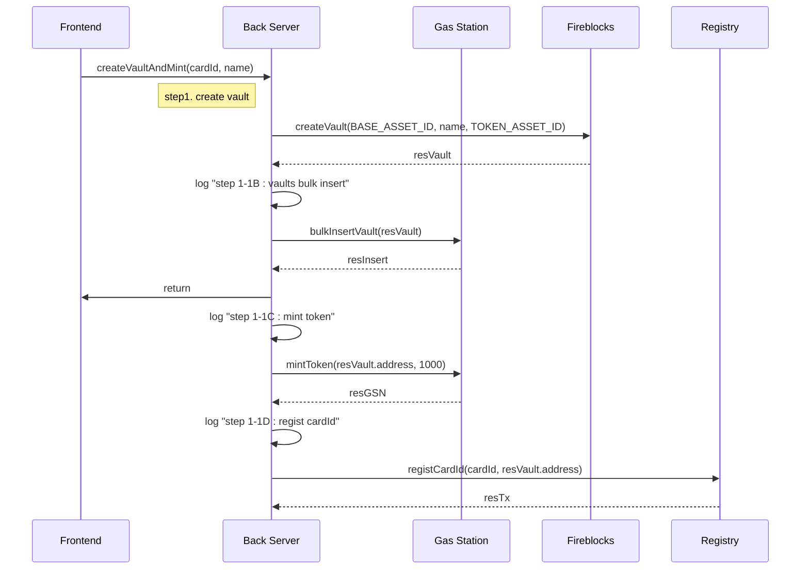

```mermaid
sequenceDiagram
    participant Frontend
    participant Back as Back Server
    participant GSN as Gas Station
    participant Fireblocks
    participant Registry

    Frontend->>Back: createVaultAndMint(cardId, name)
    Note left of Back: step1. create vault
    Back->>Fireblocks: createVault(BASE_ASSET_ID, name, TOKEN_ASSET_ID)
    Fireblocks-->>Back: resVault

    Back->>Back: log "step 1-1B : vaults bulk insert"
    Back->>GSN: bulkInsertVault(resVault)
    GSN-->>Back: resInsert

    Back->>Frontend: return

    Back->>Back: log "step 1-1C : mint token"
    Back->>GSN: mintToken(resVault.address, 1000)
    GSN-->>Back: resGSN

    Back->>Back: log "step 1-1D : regist cardId"
    Back->>Registry: registCardId(cardId, resVault.address)
    Registry-->>Back: resTx

```
