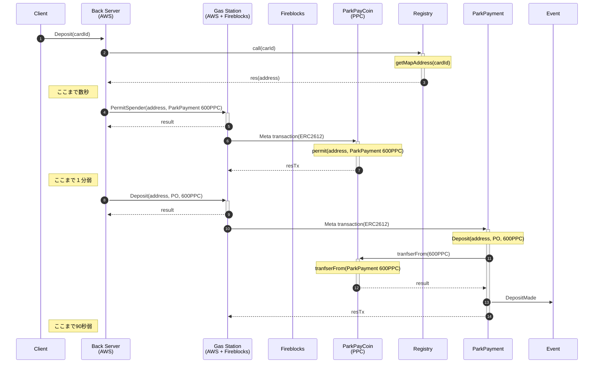

```mermaid
sequenceDiagram

    participant Client as Client
    participant Back as Back Server<br>(AWS)
    participant GSN as Gas Station<br>(AWS + Fireblocks)
    participant FB as Fireblocks
    participant PPC as ParkPayCoin<br>(PPC)
    participant Registry
    participant ParkPayment
    participant Event
    autonumber

    Client->>+Back: Deposit(cardId)
    Back->>+Registry: call(carId)
    Note over Registry: getMapAddress(cardId)
    Registry-->>-Back: res(address)

    Note left of Back:ここまで数秒

    Back->>+GSN: PermitSpender(address, ParkPayment 600PPC)
    GSN-->>-Back: result
    GSN->>+PPC: Meta transaction(ERC2612)
    Note over PPC: permit(address, ParkPayment 600PPC)
    PPC-->>-GSN: resTx

    Note left of Back:ここまで１分弱

    Back->>+GSN: Deposit(address, PO, 600PPC)
    GSN-->>-Back: result
    GSN->>+ParkPayment: Meta transaction(ERC2612)
    Note over ParkPayment: Deposit(address, PO, 600PPC)
    ParkPayment->>+PPC: tranfserFrom(600PPC)
    Note over PPC: tranfserFrom(ParkPayment 600PPC)
    PPC-->>-ParkPayment: result
    ParkPayment->>Event: DepositMade
    ParkPayment-->>-GSN: resTx

    Note left of Back:ここまで90秒弱

```
