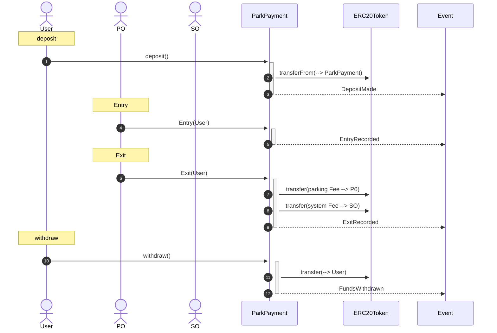

```mermaid
sequenceDiagram
    autonumber
    actor User
    actor PO as PO
    actor ServiceOwner as SO
    participant PP as ParkPayment
    participant Token as ERC20Token
    participant Event

    Note over User: deposit

    User->>+PP: deposit()
    activate PP
    PP->>+Token: transferFrom(--> ParkPayment)

    PP-->>-Event: DepositMade

    Note over PO: Entry

    PO->>+PP: Entry(User)
    activate PP
    PP-->>-Event: EntryRecorded

    Note over PO: Exit

    PO->>+PP: Exit(User)
    activate PP
    PP->>+Token: transfer(parking Fee --> P0)
    PP->>+Token: transfer(system Fee --> SO)
    PP-->>-Event: ExitRecorded

    Note over User: withdraw

    User->>+PP: withdraw()
    activate PP
    PP->>+Token: transfer(--> User)
    PP-->>-Event: FundsWithdrawn
```
