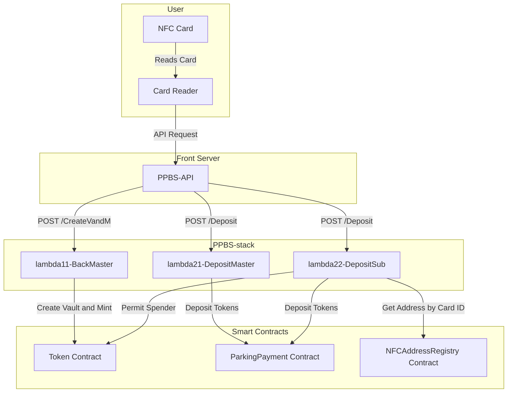

```mermaid
graph TD
    subgraph User
        A[NFC Card] -->|Reads Card| B[Card Reader]
    end

    subgraph Front Server
        B -->|API Request| C[PPBS-API]
    end

    subgraph PPBS-stack
        C -->|POST /CreateVandM| D[lambda11-BackMaster]
        C -->|POST /Deposit| E[lambda21-DepositMaster]
        C -->|POST /Deposit| F[lambda22-DepositSub]
    end

    subgraph Smart Contracts
        G[Token Contract]
        H[ParkingPayment Contract]
        I[NFCAddressRegistry Contract]
    end

    D -->|Create Vault and Mint| G
    E -->|Deposit Tokens| H
    F -->|Permit Spender| G
    F -->|Deposit Tokens| H
    F -->|Get Address by Card ID| I
```
