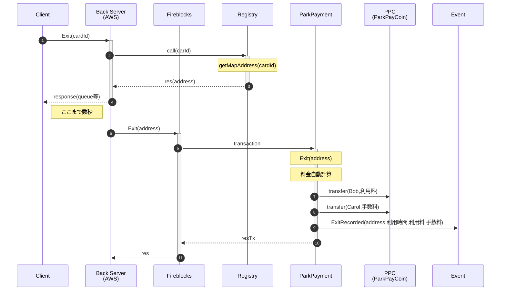

```mermaid
sequenceDiagram

    participant Client as Client
    participant Back as Back Server<br>(AWS)
    participant FB as Fireblocks
    participant Registry
    participant ParkPayment
    participant PPC as PPC<br>(ParkPayCoin)
    participant Event
    autonumber

    Client->>+Back: Exit(cardId)
    Back->>+Registry: call(carId)
    Note over Registry: getMapAddress(cardId)
    Registry-->>-Back: res(address)
    Back-->>-Client: response(queue等)

    Note left of Back:ここまで数秒

    Back->>+FB: Exit(address)
    FB->>+ParkPayment: transaction
    Note over ParkPayment: Exit(address)
    Note over ParkPayment: 料金自動計算
    ParkPayment->>PPC: transfer(Bob,利用料)
    ParkPayment->>PPC: transfer(Carol,手数料)
    ParkPayment->>Event: ExitRecorded(address,利用時間,利用料,手数料)
    ParkPayment-->>-FB: resTx
    FB-->>-Back: res

```
